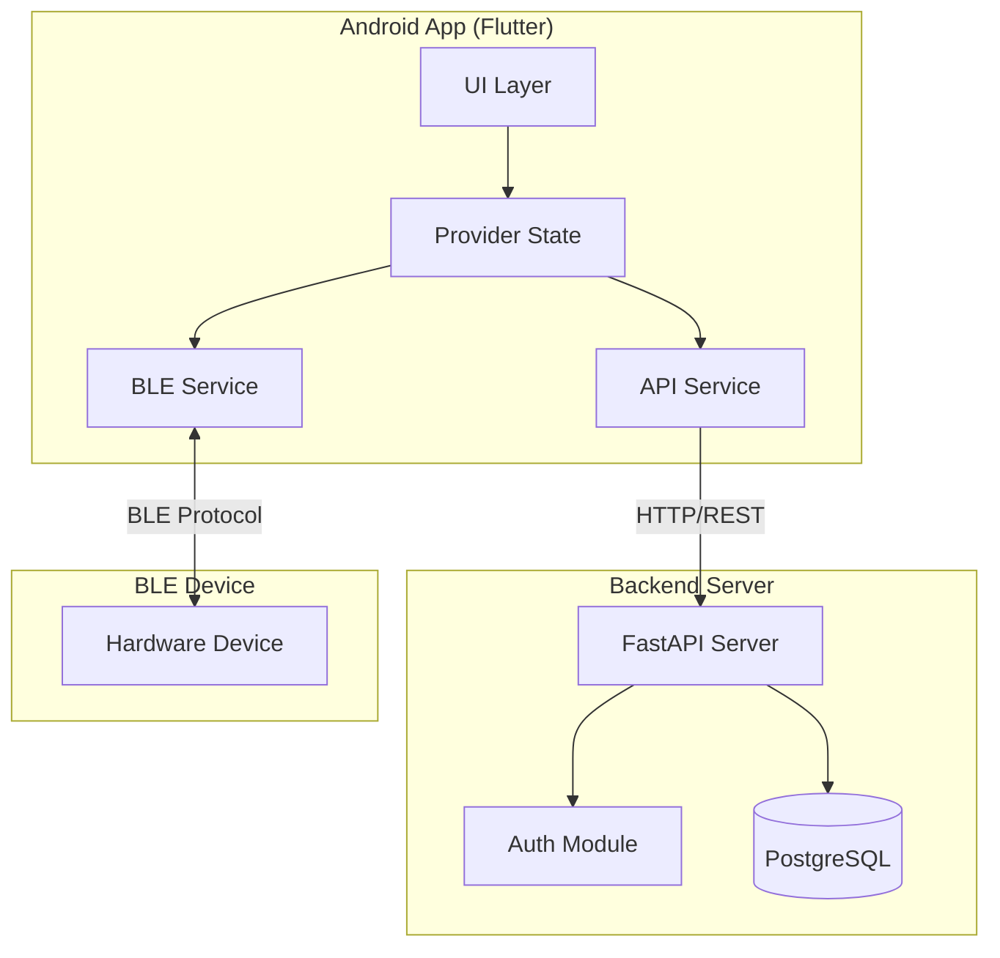
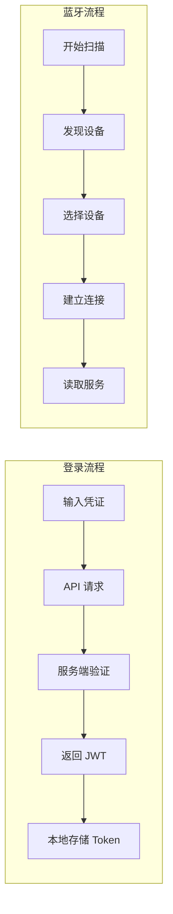

## 产品概述

将现有的 Flutter 学习项目重构为类 DJI Home 风格的 Android 应用，采用深色科技风格界面设计。应用包含完整的用户认证系统、首页仪表盘和蓝牙设备管理功能，配套 FastAPI + PostgreSQL 后端服务部署到云服务器，形成完整的移动端开发学习项目。

## 核心功能

### 用户认证模块

- 用户注册页面：包含用户名、邮箱、密码输入框，支持表单验证
- 用户登录页面：支持邮箱/密码登录，显示登录状态
- Token 管理：JWT 令牌存储与自动刷新
- 个人中心：展示用户信息，支持退出登录

### 首页仪表盘

- 顶部状态栏：显示用户头像、通知图标
- 设备概览卡片：展示已连接设备数量、设备状态统计
- 快捷操作区：常用功能入口（扫描设备、设备列表、设置等）
- 最近活动：显示最近的设备连接记录

### 蓝牙设备管理

- 设备扫描：扫描周围 BLE 设备，实时显示扫描结果
- 设备列表：展示已发现设备的名称、信号强度、MAC 地址
- 设备配对：支持与 BLE 设备建立配对连接
- 连接状态管理：实时显示设备连接状态，支持断开连接
- 设备详情：展示已连接设备的服务和特征值

### 后端服务

- RESTful API：提供用户认证、设备信息同步接口
- 数据持久化：PostgreSQL 存储用户数据和设备记录
- 云端部署：服务部署到云服务器，支持远程访问

## 技术栈

### 前端 (Flutter Android)

- **框架**: Flutter 3.x + Dart
- **状态管理**: Provider (沿用现有项目)
- **蓝牙通信**: flutter_blue_plus (BLE 通信库)
- **网络请求**: dio (HTTP 客户端)
- **本地存储**: shared_preferences (Token 存储)
- **路由管理**: go_router (声明式路由)

### 后端 (FastAPI)

- **框架**: FastAPI + Python 3.11+
- **数据库**: PostgreSQL + SQLAlchemy ORM
- **认证**: JWT (python-jose)
- **密码加密**: passlib + bcrypt
- **数据验证**: Pydantic

### 部署

- **容器化**: Docker + Docker Compose
- **云服务器**: Linux 服务器部署

## 技术架构

### 系统架构



### 模块划分

**Flutter 应用模块**

| 模块 | 职责 | 依赖 |
| --- | --- | --- |
| Core | 基础配置、常量、工具类 | - |
| Auth | 用户认证、Token 管理 | Core, API |
| Home | 首页仪表盘展示 | Core, Auth |
| Bluetooth | BLE 设备扫描、连接管理 | Core |
| API | 网络请求封装 | Core |


**后端服务模块**

| 模块 | 职责 | 技术 |
| --- | --- | --- |
| Auth | 用户注册/登录、JWT 签发 | python-jose |
| User | 用户信息管理 | SQLAlchemy |
| Device | 设备记录同步 | SQLAlchemy |


### 数据流



## 实现细节

### 核心目录结构

```
flutter_application_1/
├── lib/
│   ├── main.dart                    # 应用入口
│   ├── app.dart                     # App 配置
│   ├── core/
│   │   ├── constants/               # 常量定义
│   │   ├── theme/                   # 主题配置
│   │   └── utils/                   # 工具类
│   ├── models/                      # 数据模型
│   │   ├── user.dart
│   │   └── device.dart
│   ├── services/
│   │   ├── api_service.dart         # API 请求服务
│   │   ├── auth_service.dart        # 认证服务
│   │   └── bluetooth_service.dart   # 蓝牙服务
│   ├── providers/
│   │   ├── auth_provider.dart       # 认证状态
│   │   ├── device_provider.dart     # 设备状态
│   │   └── bluetooth_provider.dart  # 蓝牙状态
│   ├── screens/
│   │   ├── auth/
│   │   │   ├── login_screen.dart
│   │   │   └── register_screen.dart
│   │   ├── home/
│   │   │   └── home_screen.dart
│   │   ├── bluetooth/
│   │   │   ├── scan_screen.dart
│   │   │   └── device_detail_screen.dart
│   │   └── profile/
│   │       └── profile_screen.dart
│   └── widgets/                     # 可复用组件
│       ├── device_card.dart
│       └── status_indicator.dart
├── android/                         # Android 配置
└── pubspec.yaml

backend/
├── app/
│   ├── main.py                      # FastAPI 入口
│   ├── core/
│   │   ├── config.py                # 配置
│   │   ├── security.py              # JWT 处理
│   │   └── database.py              # 数据库连接
│   ├── models/
│   │   └── user.py                  # SQLAlchemy 模型
│   ├── schemas/
│   │   └── user.py                  # Pydantic 模式
│   ├── routers/
│   │   ├── auth.py                  # 认证路由
│   │   └── user.py                  # 用户路由
│   └── services/
│       └── auth_service.py          # 认证业务逻辑
├── requirements.txt
├── Dockerfile
└── docker-compose.yml
```

### 关键代码结构

**User 数据模型 (Flutter)**

```
class User {
  final int id;
  final String email;
  final String username;
  final DateTime createdAt;
  
  User({required this.id, required this.email, required this.username, required this.createdAt});
  
  factory User.fromJson(Map<String, dynamic> json) => User(
    id: json['id'],
    email: json['email'],
    username: json['username'],
    createdAt: DateTime.parse(json['created_at']),
  );
}
```

**BLE Device 数据模型**

```
class BleDevice {
  final String id;
  final String name;
  final int rssi;
  final bool isConnected;
  
  BleDevice({required this.id, required this.name, required this.rssi, this.isConnected = false});
}
```

**FastAPI User 模型**

```python
class User(Base):
    __tablename__ = "users"
    
    id = Column(Integer, primary_key=True, index=True)
    email = Column(String, unique=True, index=True)
    username = Column(String, unique=True)
    hashed_password = Column(String)
    created_at = Column(DateTime, default=datetime.utcnow)
```

### 技术实现要点

**1. JWT 认证流程**

- 登录成功后服务端签发 access_token 和 refresh_token
- Flutter 端使用 shared_preferences 持久化存储
- dio 拦截器自动添加 Authorization 头
- Token 过期时自动刷新

**2. BLE 通信实现**

- 使用 flutter_blue_plus 进行设备扫描
- 扫描结果通过 Stream 实时更新 UI
- 连接状态变化触发 Provider 通知

**3. Android 权限配置**

- 蓝牙权限: BLUETOOTH, BLUETOOTH_ADMIN, BLUETOOTH_SCAN, BLUETOOTH_CONNECT
- 位置权限: ACCESS_FINE_LOCATION (Android 12 以下扫描 BLE 必需)

### 集成点

**Flutter 与后端 API**

- 基础 URL 配置支持开发/生产环境切换
- 统一错误处理和响应解析
- 请求/响应日志记录

**数据格式**

- API 通信: JSON
- 认证头: Bearer Token

## 设计风格

采用 DJI Home App 深色科技风格，营造专业、高端的视觉体验。界面以深色背景为主，搭配蓝色系渐变高亮色彩，卡片式布局展示信息，底部导航栏实现页面切换。

## 页面规划

### 1. 登录页面

- **顶部区域**: 应用 Logo 和名称，居中显示，带微光效果
- **表单区域**: 深色卡片容器，包含邮箱和密码输入框，输入框带蓝色聚焦边框
- **按钮区域**: 蓝色渐变登录按钮，圆角设计，点击有按压动效
- **底部链接**: 注册入口文字链接

### 2. 注册页面

- **顶部区域**: 返回按钮和页面标题
- **表单区域**: 用户名、邮箱、密码、确认密码输入框，带实时验证提示
- **按钮区域**: 蓝色渐变注册按钮
- **协议区域**: 用户协议勾选项

### 3. 首页仪表盘

- **顶部导航**: 用户头像（左）、应用标题（中）、通知图标（右），半透明背景
- **设备概览卡片**: 大尺寸卡片，显示已连接设备数、在线设备数，带渐变背景和图标
- **快捷操作区**: 2x2 网格布局，图标+文字按钮（扫描设备、设备列表、数据同步、设置）
- **最近活动**: 列表形式展示最近设备连接记录，每条记录显示设备名、时间、状态
- **底部导航栏**: 首页、设备、个人中心三个 Tab，带图标和文字

### 4. 蓝牙扫描页面

- **顶部区域**: 页面标题、扫描状态指示器（扫描中显示旋转动画）
- **扫描按钮**: 圆形蓝色按钮，点击开始/停止扫描
- **设备列表**: 卡片式列表，每个设备卡片显示设备名称、信号强度图标、MAC 地址、连接按钮
- **空状态**: 未发现设备时显示引导图和提示文字

### 5. 设备详情页面

- **顶部区域**: 返回按钮、设备名称、连接状态指示灯
- **设备信息卡片**: 显示 MAC 地址、信号强度、连接时间
- **服务列表**: 展开式列表，显示 BLE 服务 UUID 和特征值
- **操作按钮**: 断开连接按钮

### 6. 个人中心页面

- **头像区域**: 大尺寸用户头像、用户名、邮箱
- **功能列表**: 账户设置、关于应用、退出登录，列表项带右箭头
- **版本信息**: 底部显示应用版本号